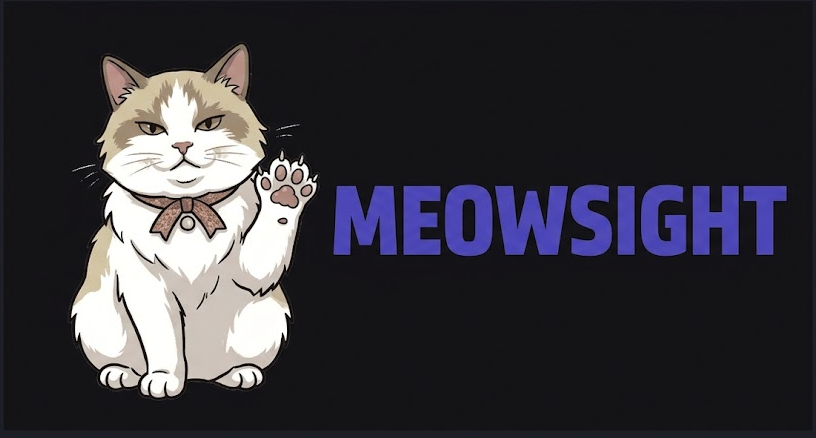

# 🐱 MeowSight — AI Agent Infrastructure Management

<p align="center">
  
</p>

<p align="center">
  <strong>AI Agent Infrastructure Management Platform</strong>
</p>

<p align="center">
  <em>"Millions of AI agents are running. Who's watching them?"</em><br>
  MeowSight monitors, secures, audits, and controls your AI agents — starting with just one env var change.
</p>

<p align="center">
  <a href="#how-it-works">How It Works</a> &bull;
  <a href="#core-features">Features</a> &bull;
  <a href="#getting-started">Getting Started</a> &bull;
  <a href="#roadmap">Roadmap</a>
</p>

---

> The same logic as selling pickaxes during a gold rush — the more agents there are, the more valuable this infrastructure becomes.

---

## How It Works

MeowSight is an **LLM reverse proxy** that sits between your AI agents and LLM providers. Agents just change one environment variable — no code changes required:

```bash
# Before — agent talks directly to LLM provider
OPENAI_BASE_URL=https://api.openai.com/v1
ANTHROPIC_BASE_URL=https://api.anthropic.com

# After — route through MeowSight proxy
OPENAI_BASE_URL=https://proxy.meowsight.io/openai/v1
ANTHROPIC_BASE_URL=https://proxy.meowsight.io/anthropic/v1
```

The proxy transparently forwards requests while capturing:

- **Token usage and cost** per request (calculated from `configs/pricing.json`)
- **Response latency and error rates**
- **Full request/response audit trail** (configurable)
- **Model and provider breakdown**
- **Per-agent attribution** (via `X-Meowsight-Agent` / `X-Meowsight-Tenant` headers)

```
AI Agents (millions)
    │
    │  LLM API calls (OpenAI, Anthropic, ...)
    ▼
┌────────────────────────────────────────────┐
│         MeowSight LLM Proxy                │
│         (meowsight-proxy)                  │
│                                            │
│  ┌─────────────┐  ┌──────────────────┐     │
│  │ OpenAI      │  │ Anthropic        │     │
│  │ Provider    │  │ Provider         │     │
│  │ (+ Azure,   │  │                  │     │
│  │  compatible)│  │                  │     │
│  └──────┬──────┘  └────────┬─────────┘     │
│         │                  │               │
│         └────────┬─────────┘               │
│                  ▼                         │
│     Extract: tokens, cost, latency         │
│     Emit: RequestEvent                     │
└──────────────────┬─────────────────────────┘
                   │
                   │  NATS JetStream
                   ▼
┌──────────────────────────────────────────┐
│          Event Bus (NATS JetStream)      │
│          subjects: events.{tenant}.{type}│
└──┬──────────┬──────────┬─────────────────┘
   │          │          │
   ▼          ▼          ▼
 Metric     Audit      Cost
 Writer     Writer     Aggregator
   │          │          │
   ▼          ▼          ▼
ClickH.   ClickH.     PostgreSQL
          + S3
```

**Currently supported providers:** OpenAI, Anthropic (implemented). Planned: Google Gemini, Azure OpenAI, AWS Bedrock, and any OpenAI-compatible API.

---

## Core Features

| Domain | Description | How |
|---|---|---|
| **Agent Monitoring** | Latency, error rates, request volume, agent liveness | Extracted from proxy traffic |
| **Security** | Model/provider allowlists, rate limiting, content filtering | Enforced at proxy layer |
| **Audit Trail** | Full LLM request/response logging, tamper-proof records | Stored in ClickHouse + S3 |
| **Cost Management** | Token counting, cost calculation, budget enforcement | Pricing table + real-time aggregation |

---

## System Architecture

### Data Flow

1. Agents route LLM API calls through the MeowSight proxy — cost, latency, and audit data are captured transparently
2. The proxy emits `RequestEvent`s to NATS JetStream
3. Domain-specific consumers process events and write to appropriate storage
4. The proxy can enforce budgets by rejecting requests when spend exceeds limits

### Storage Strategy

| Store | Technology | Purpose | Retention |
|---|---|---|---|
| Config DB | PostgreSQL | Tenants, agents, policies, budgets | Permanent |
| Metrics | ClickHouse | Time-series metrics | 90 days hot, 1 year cold |
| Audit Hot | ClickHouse | Recent audit logs | 30 days |
| Audit Cold | S3 (Parquet) | Long-term audit logs | Up to 7 years |
| Cache | Redis Cluster | Real-time status, rate limits | Ephemeral |
| Event Bus | NATS JetStream | Inter-service events | 72h replay window |

### Multi-Tenant Architecture

- **PostgreSQL:** Row-Level Security (RLS) + `tenant_id` column
- **ClickHouse:** Partitioned by `(tenant_id, toYYYYMM(timestamp))`
- **NATS:** Subject hierarchy `events.{tenant_id}.{event_type}`

---

## Tech Stack

| Layer | Technology | Rationale |
|---|---|---|
| Language | **Go** | High performance, concurrency, single binary deployment |
| HTTP | `net/http` + `chi/v5` | Lightweight, composable middleware |
| PostgreSQL | `pgx/v5` | Config, tenants, policies, budgets |
| ClickHouse | `clickhouse-go/v2` | Metrics + audit logs (high-volume time-series) |
| Redis | `go-redis/v9` | Cache, rate limiting |
| Message Queue | **NATS JetStream** | Low latency, simple operations, at-least-once delivery |
| Object Storage | S3 / MinIO | Long-term audit log archive (Parquet) |
| Deployment | Kubernetes + Helm | Production orchestration |

---

## Project Structure

```
meowsight/
├── cmd/
│   ├── meowsight-api/                # REST API server
│   ├── meowsight-proxy/              # LLM reverse proxy
│   ├── meowsight-ingest/             # Event ingestion worker
│   ├── meowsight-worker/             # Background job processor
│   └── meowctl/                      # CLI tool
│
├── configs/
│   └── pricing.json                  # Model pricing table (edit without rebuild)
│
├── internal/
│   ├── config/                       # App configuration (env vars)
│   ├── proxy/                        # LLM proxy engine ✅ Implemented
│   │   ├── router.go                 # Route requests to correct LLM provider
│   │   ├── event.go                  # RequestEvent struct + EventEmitter interface
│   │   ├── event_logger.go           # Dev-mode event logger (slog)
│   │   ├── pricing.go                # PricingTable — loads from configs/pricing.json
│   │   ├── tagger.go                 # Agent attribution from X-Meowsight-* headers
│   │   └── provider/
│   │       ├── openai.go             # OpenAI / OpenAI-compatible (streaming + non-streaming)
│   │       └── anthropic.go          # Anthropic Claude (streaming + non-streaming)
│   ├── domain/                       # Pure domain types
│   ├── app/                          # Application services (use cases + ports)
│   ├── adapter/                      # Infrastructure adapters (postgres, clickhouse, redis, nats, s3)
│   ├── handler/                      # REST API handlers
│   └── engine/                       # Background engines (alerting, cost, archiver)
│
├── pkg/
│   └── errors/                       # Shared error types
│
├── migrations/
│   ├── postgres/001_init.up.sql      # Tenants, agents, budgets, model_pricing
│   └── clickhouse/001_init.up.sql    # Metrics + audit_log tables
│
├── deploy/docker/                    # Multi-stage Dockerfiles
├── .github/workflows/ci.yml         # CI: test + lint
├── docker-compose.yml               # Local dev: PG, ClickHouse, Redis, NATS, MinIO
├── Makefile
└── go.mod
```

---

## Getting Started

```bash
# Start local infrastructure
docker-compose up -d  # PostgreSQL, ClickHouse, Redis, NATS, MinIO

# Build all binaries
make build

# Run tests
make test

# Run the LLM proxy (default port 8081)
./bin/meowsight-proxy

# Run the API server (default port 8080)
./bin/meowsight-api
```

### Configuration

All configuration is via environment variables with sensible defaults:

| Variable | Default | Description |
|---|---|---|
| `PROXY_PORT` | `8081` | LLM proxy listen port |
| `HTTP_PORT` | `8080` | API server listen port |
| `OPENAI_BASE_URL` | `https://api.openai.com` | OpenAI upstream URL |
| `ANTHROPIC_BASE_URL` | `https://api.anthropic.com` | Anthropic upstream URL |
| `PRICING_FILE` | `configs/pricing.json` | Path to model pricing table |
| `POSTGRES_HOST` | `localhost` | PostgreSQL host |
| `CLICKHOUSE_HOST` | `localhost` | ClickHouse host |
| `REDIS_ADDR` | `localhost:6379` | Redis address |
| `NATS_URL` | `nats://localhost:4222` | NATS server URL |

### Model Pricing

Model pricing is managed in `configs/pricing.json` — no code changes or rebuilds needed:

```json
{
  "models": {
    "gpt-4o": {"provider": "openai", "input_per_1k": 0.0025, "output_per_1k": 0.01},
    "claude-sonnet-4-0": {"provider": "anthropic", "input_per_1k": 0.003, "output_per_1k": 0.015}
  }
}
```

---

## Roadmap

### v0.1 — LLM Proxy Core

- [x] Project scaffolding, Go module, `Makefile`, `.gitignore` ✅
- [x] Docker Compose (PostgreSQL, ClickHouse, Redis, NATS, MinIO) ✅
- [x] CI pipeline (`go vet` + `staticcheck`) ✅
- [x] Multi-stage Dockerfiles (api, proxy, ingest, worker) ✅
- [x] DB migrations (PostgreSQL + ClickHouse) ✅
- [x] OpenAI reverse proxy (non-streaming + SSE streaming) ✅
- [x] Anthropic reverse proxy (non-streaming + SSE streaming) ✅
- [x] Token/cost extraction from LLM responses ✅
- [x] External pricing table (`configs/pricing.json`) ✅
- [x] Configurable provider base URLs via env vars ✅
- [x] Agent attribution via `X-Meowsight-*` headers ✅
- [x] Auto-inject `stream_options.include_usage` for OpenAI streaming ✅

### v0.2 — Event Pipeline & Dashboard

- [ ] Event emission to NATS JetStream
- [ ] ClickHouse metric writer (latency, tokens, errors)
- [ ] ClickHouse audit writer (request/response logs)
- [ ] Agent auto-discovery from proxy traffic
- [ ] REST API for dashboard queries
- [ ] Web dashboard (cost trends, agent status, audit logs)
- [ ] API key authentication for tenants
- [ ] Tenant registration and management
- [ ] All-in-one `docker compose up` for full local deployment (proxy, api, ingest, worker + infra)

### v0.3 — Budget & Security

- [ ] Budget enforcement (reject requests on overage)
- [ ] Model/provider allowlists per tenant
- [ ] Per-agent cost dashboard
- [ ] Cost anomaly alerts (webhook / email)
- [ ] Error rate spike detection
- [ ] Agent-down detection
- [ ] `meowctl top` — real-time CLI dashboard (agent traffic, cost, latency, errors)
- [ ] Content filtering
- [ ] PII masking in audit logs

### v0.4 — More Providers & Hardening

- [ ] Google Gemini provider
- [ ] Azure OpenAI provider
- [ ] AWS Bedrock provider
- [ ] Any OpenAI-compatible API support
- [ ] RBAC for dashboard
- [ ] Threat detection v1 (runaway agent / cost spike)
- [ ] Audit archiver (S3 Parquet export)
- [ ] Multi-tenant hardening (RLS, per-tenant rate limiting)

### v1.0 — SaaS Launch

- [ ] Stripe billing integration (subscriptions, usage-based overage)
- [ ] Plan enforcement and usage metering
- [ ] Kubernetes Helm charts + HPA
- [ ] Production deployment
- [ ] Documentation site
- [ ] Onboarding flow
- [ ] `meowctl doctor` — self-diagnosis tool

> **Future:** SDK and agent-side integration (Go, Python, TypeScript) for distributed locking, intent-based conflict prevention, and server-push directives — added based on user demand after proxy MVP is validated.

---

## Key Design Decisions

| Decision | Rationale |
|---|---|
| LLM Proxy as MVP | Zero-code integration (env var change only) maximizes adoption; covers monitoring, security, audit, and cost without agent modifications |
| External pricing table (JSON) | Model prices change frequently; JSON file avoids code changes and rebuilds, upgradeable to DB later |
| Configurable provider base URLs | Supports Azure OpenAI, local mocks, and custom endpoints via env vars without code changes |
| Separate proxy and API binaries | Independent scaling; dashboard queries don't starve proxy traffic |
| ClickHouse for metrics and audit | Reduced operational complexity, same query patterns, splittable later |
| NATS over Kafka | Lower latency, simpler operations, swappable via adapter pattern |

---

## Why "MeowSight"?

Cats see in the dark. MeowSight gives you visibility into the invisible — what your AI agents are doing, how much they cost, and whether they're behaving. Like a cat watching from the shadows, it observes everything without getting in the way.

---

## Contributing

AI/vibe-coded PRs welcome!

---

## License

MIT
